* Primera Parte: Creación de un proyecto en GitHub y uso de las ramas

0. Creación del proyecto actividad-01 en Github: Como el repositorio de proyectos del máster ya se encuentra creado, se crea un directorio nuevo que tendrá los incrementos para la actividad 1.

1. Crear las tareas en el Kanban de GitHub que consideres necesarias para este proyecto.

2. Creación de la rama develop a partir de main
   (En mi caso, la rama master)
   
3. Creación de la rama feature-1 y añadir la clase A con los atributos: foo bar (tal como se ve en la imagen Crear Clase A)

4. Mergear feature-1 con develop

5. Mergear develop con main (master) y generar tag v1.0
M.png" />
M.png" />
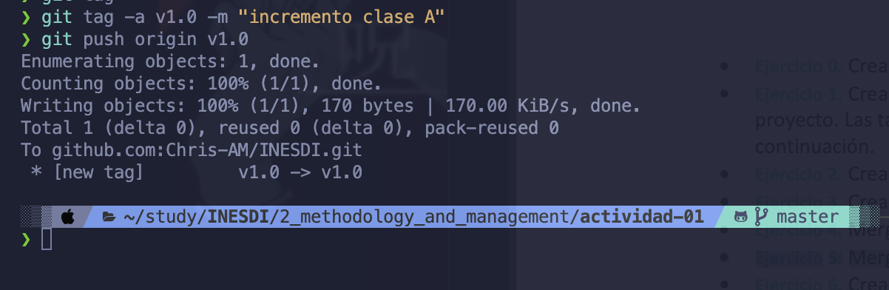
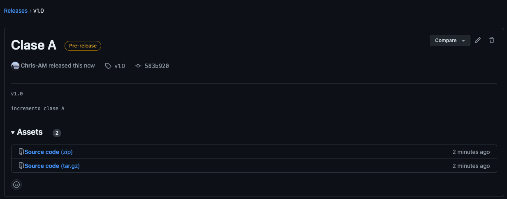

* Segunda Parte: Merge de dos ramas y posible resolución de conflictos

6 y 7. Creación de la rama feature-2 y añadir la clase B. Creación de la rama feature-3 y añadir la clase C.

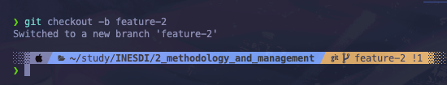
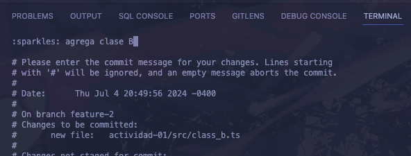

8 y 9. Mergear feature-2 y feature-3 con develop.

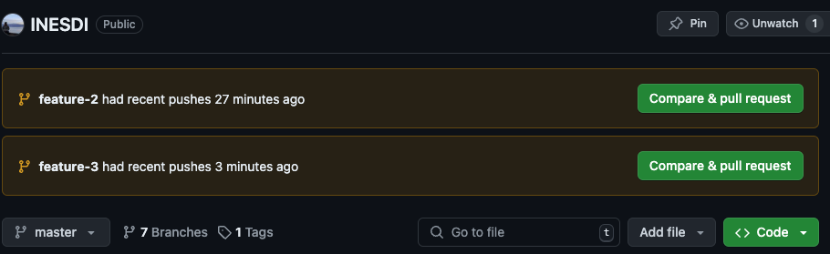
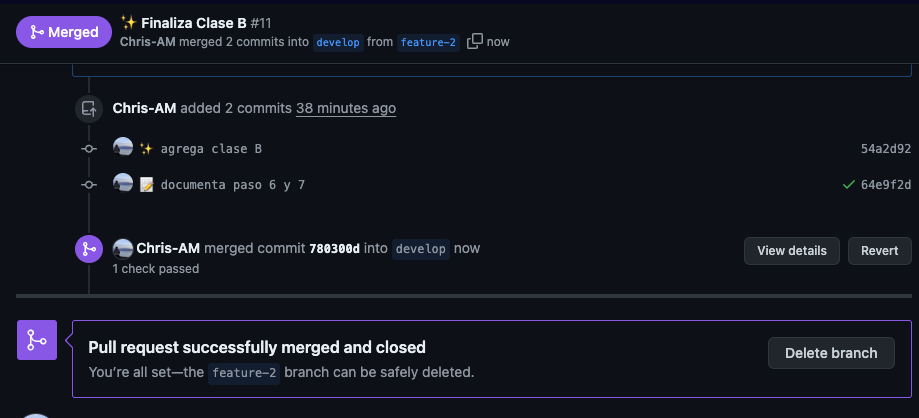
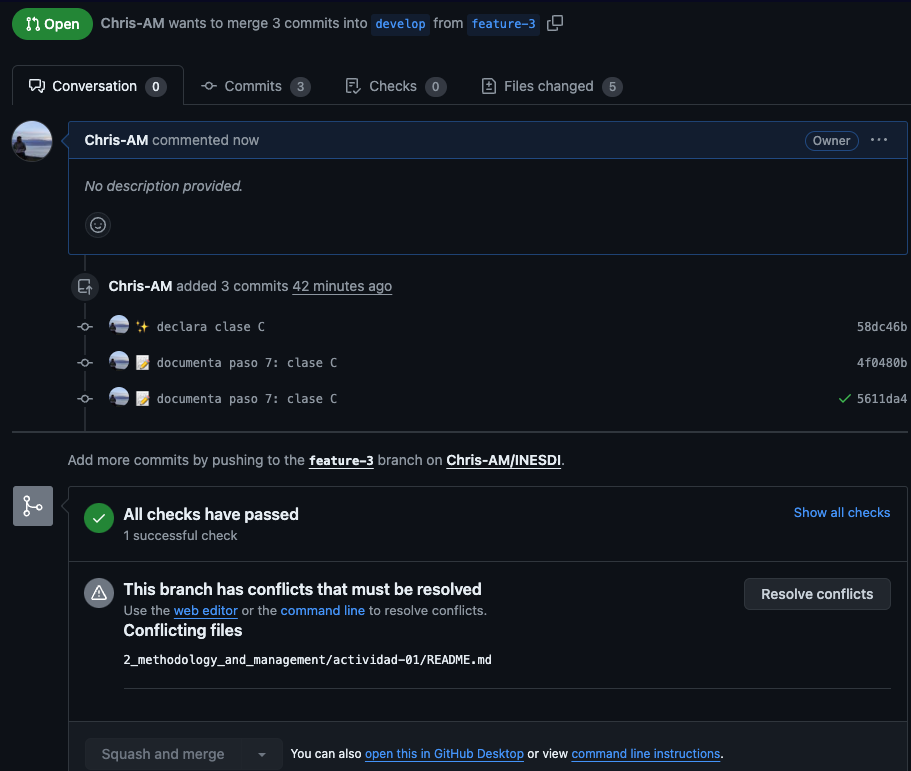
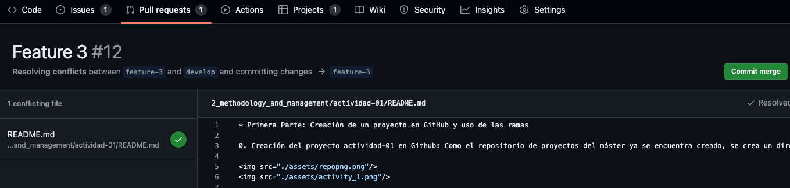
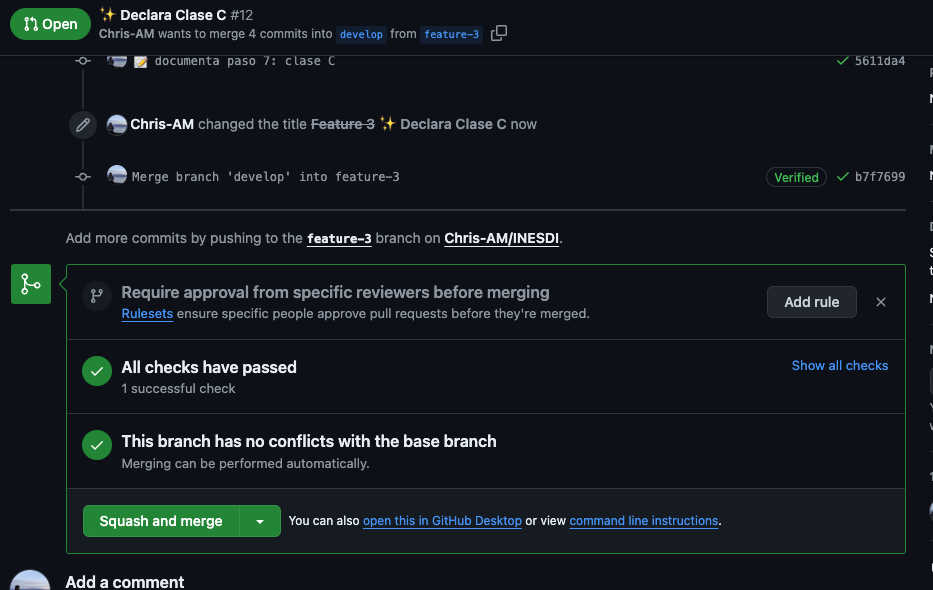

10. Mergear develop con main y creación de la etiqueta v2.0.

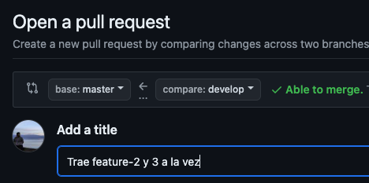
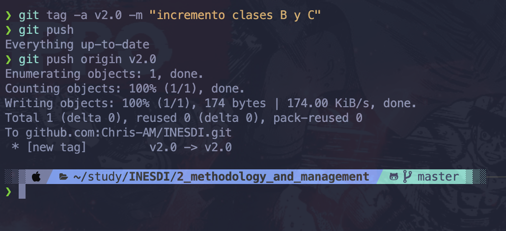

11. Creación de rama hotfix-1 a partir de main y añadir un atributo lorem en clase A.

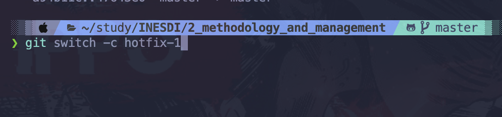
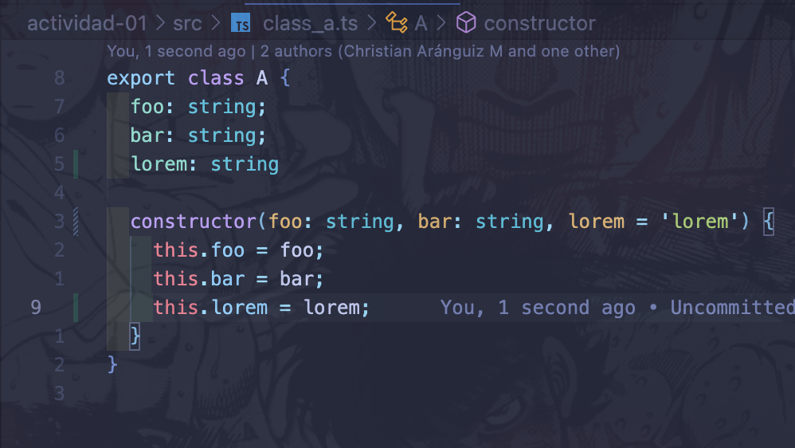

12. Mergear rama hotfix-1 con main y creación de etiqueta v2.1

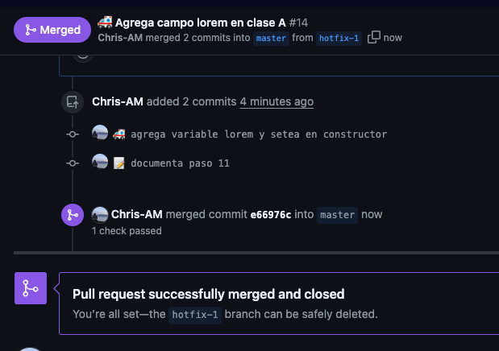