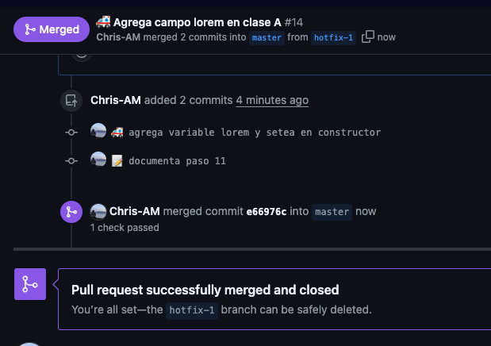
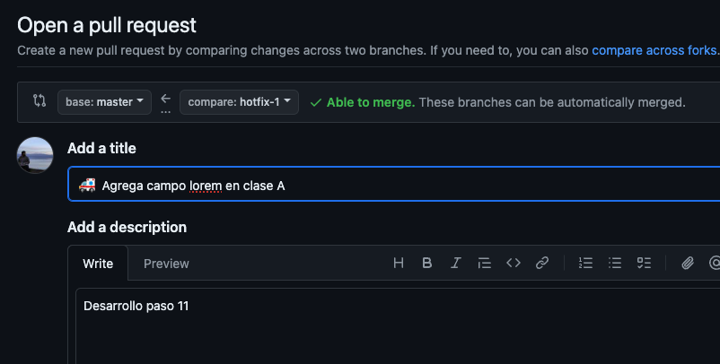
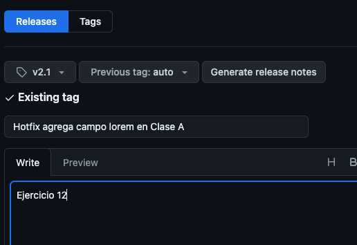
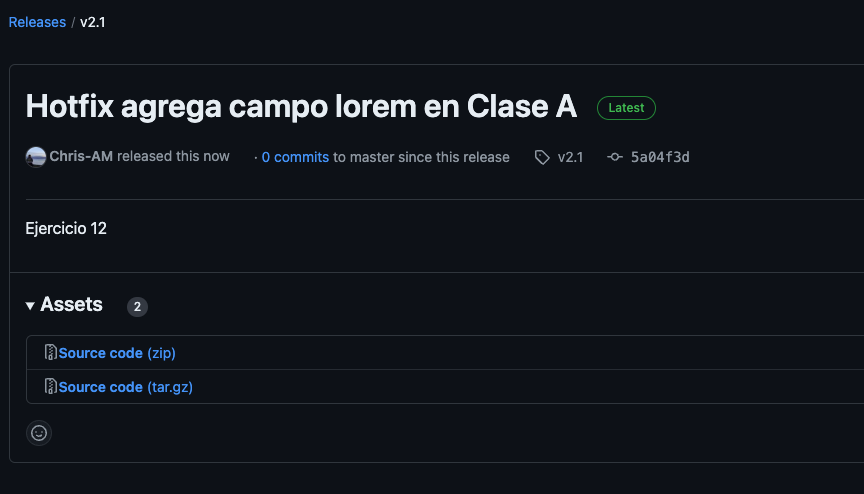

<h1>ACTIVIDAD 01 – TEMA 2</h1>
<h2>Primera Parte: Creación de un proyecto en GitHub y uso de las ramas</h2>

0. Creación del proyecto actividad-01 en Github:

Como el repositorio de proyectos del máster ya se encuentra creado, se crea un directorio nuevo que tendrá los incrementos para la actividad 1.

1. Crear las tareas en el Kanban de GitHub que consideres necesarias para este proyecto.

Para la actividad 1 se crearon las siguientes tareas:

a. Crear Clase A
b. Primer paso a la versión 1.0
c. Crear Clase B
d. Crear Clase C
e. Segundo paso a la versión 2.0

<h6> Cabe aclarar que las tareas de hotfix no se crearon en el kanban, pero se realizaron en el desarrollo de la actividad.</h6>

<h6>Las tareas se movieron a medida que se completaban.</h6>

2. Creación de la rama develop a partir de main
   (En mi caso, la rama master)
   
3. Creación de la rama feature-1 y añadir la clase A con los atributos: foo bar (tal como explican las CA del Kanban)

<h5> Movimientos en la rama feature-1 </h5>

4. Mergear feature-1 con develop
   
   
   

5. Mergear develop con main (master) y generar tag v1.0
M.png" />
M.png" />

<h6>Se creó la etiqueta v1.0 y se tituló como Clase A</h6>

- Segunda Parte: Merge de dos ramas y posible resolución de conflictos

6 y 7. Creación de la rama feature-2 y añadir la clase B. Creación de la rama feature-3 y añadir la clase C.

<h5> Debido a que las clases B y C son iguales a la A, solo se muestran los commits y los movimientos de la rama feature-2. </h5>

8 y 9. Mergear feature-2 y feature-3 con develop.

<h6>Ambas ramas vistas desde master</h6>

<h6>Se muestra el conflicto en la rama feature-3</h6>

<h6>Se muestra el conflicto resuelto en la rama feature-3</h6>

10. Mergear develop con main y creación de la etiqueta v2.0.

11. Creación de rama hotfix-1 a partir de main y añadir un atributo lorem en clase A.

<h6>Se muestra el cambio en la rama hotfix-1 usando <code>switch -c</code> en vez de <code>checkout -b</code></h6>

12. Mergear rama hotfix-1 con main y creación de etiqueta v2.1
     
     
     
    
