0. Creación del proyecto actividad-01 en Github: Como el repositorio de proyectos del máster ya se encuentra creado, se crea un directorio nuevo que tendrá los incrementos para la actividad 1.

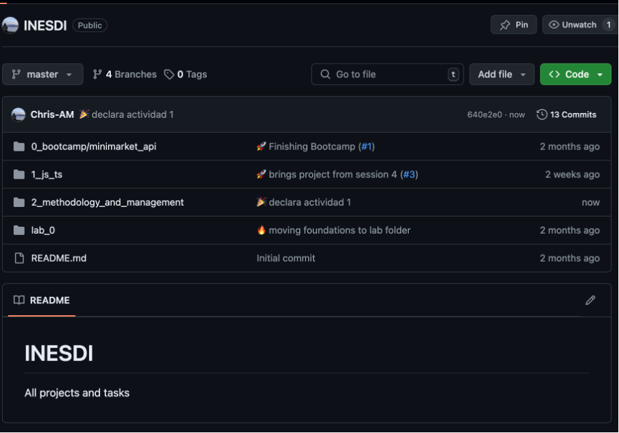
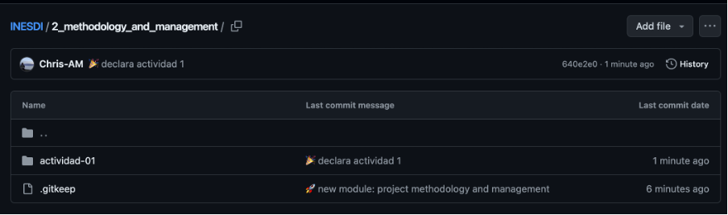

1. Crear las tareas en el Kanban de GitHub que consideres necesarias para este proyecto.

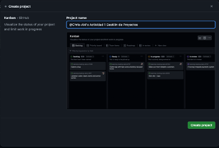
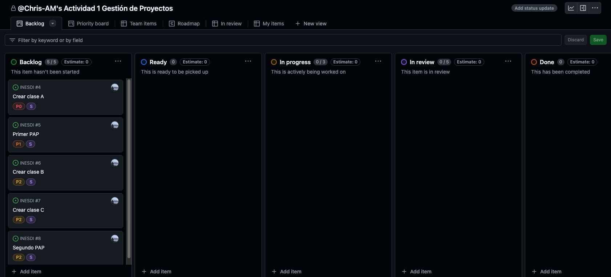
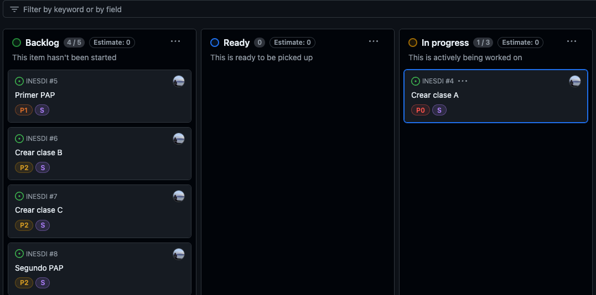
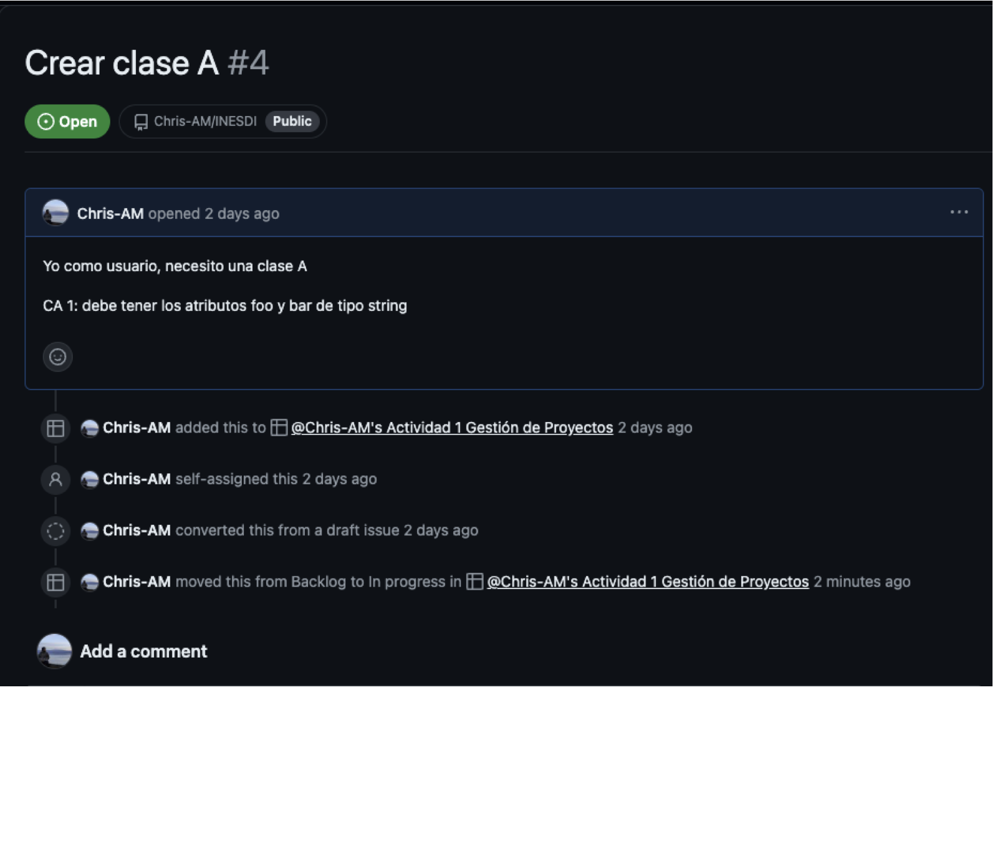

2. Creación de la rama develop a partir de main
   (En mi caso, la rama master)
   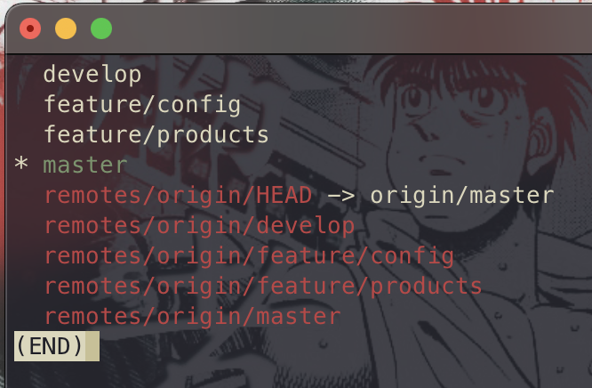
3. Creación de la rama feature-1 y añadir la clase A con los atributos: foo bar (tal como se ve en la imagen Crear Clase A)

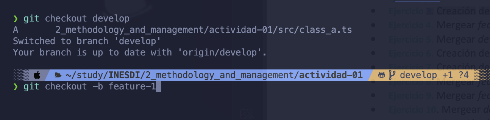
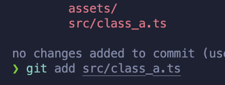
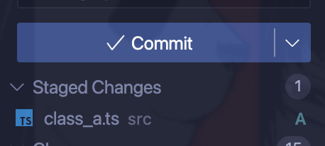
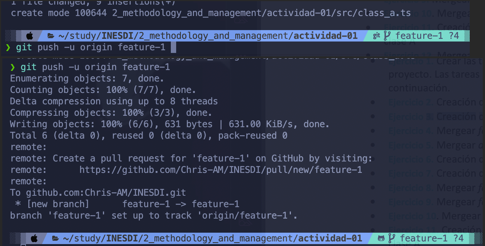

4. Mergear feature-1 con develop
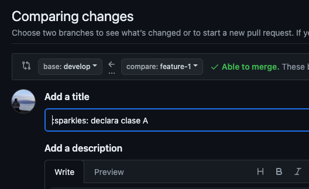
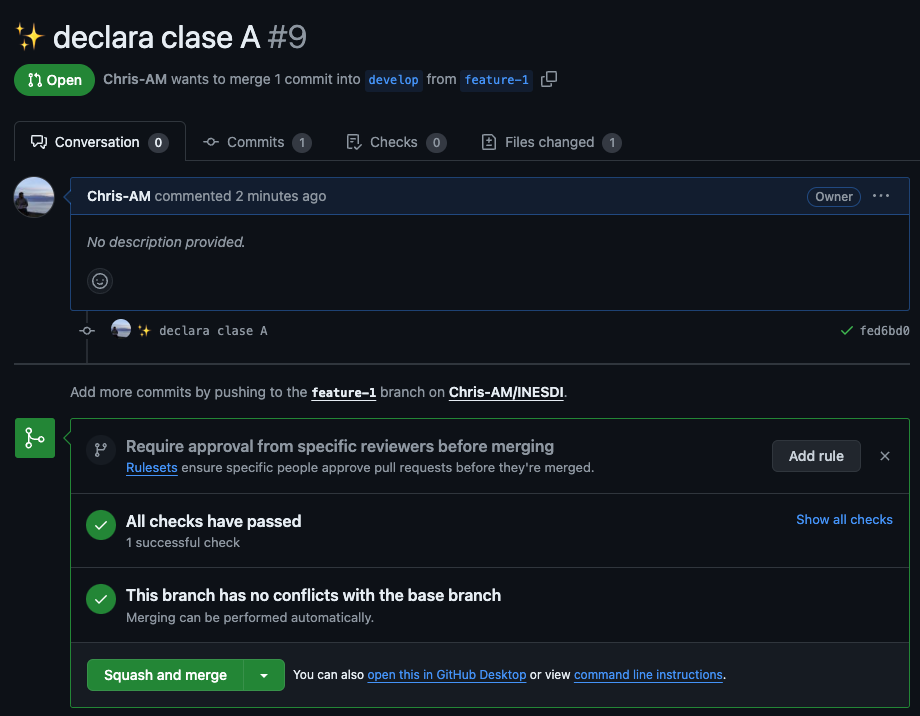
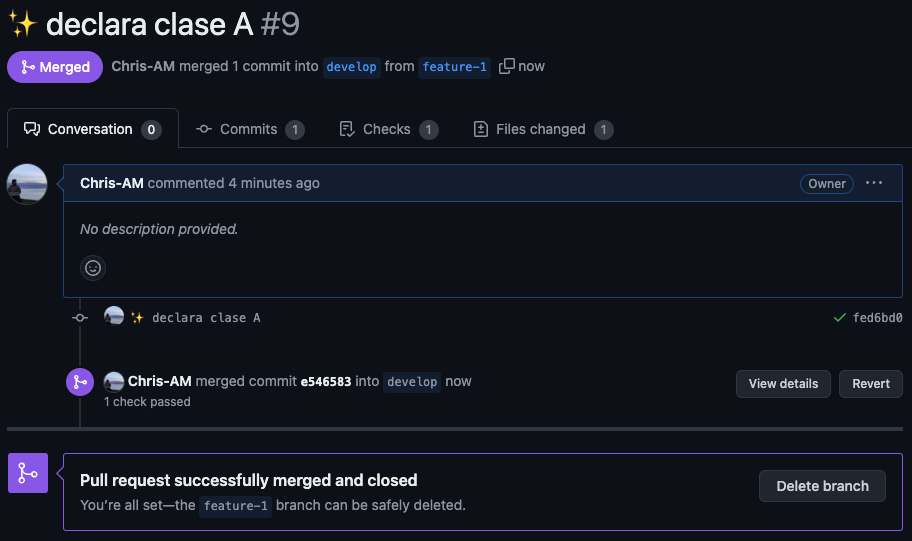

5. Mergear develop con main (master) y generar tag v1.0
M.png" />
M.png" />
